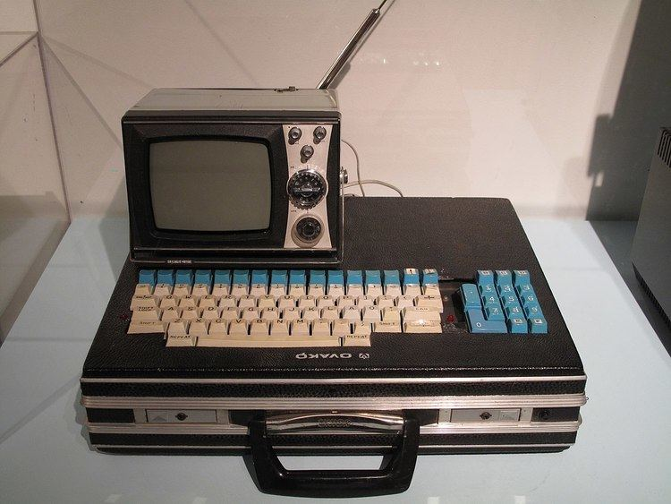

# CHIP-8

## Table of contents

1. [What is CHIP-8](#chip8-whatis)
1. [Specifications](#chip8-specs)
1. [Instruction set](#chip8-instructions)
1. [Extensions](#chip8-extensions)
1. [Computers that used the CHIP-8 interpreter](#chip8-computers)

## What is CHIP-8 <a id="chip8-whatis"></a> [↑](#table-of-contents)

CHIP-8 is an interpreted programming language designed for develop programs with low requirements.

It was originaly designed by Joseph Weisbecker for the [COSMAC VIP](#cosmac-vip) and the [Telmac 1800](#telmac-1800) computers.

Is used mainly for develop games and exists a lot of interpreters for diferent machines such as computers or game consoles. 

## Specifications <a id="chip8-specs"></a> [↑](#table-of-contents)

### Registers

* 16 registers V0 to VF.
    * 8-bit general purpouse registers.
    * VF is used as a flag by some instructions
* I register
    * 12-bit register
    * used for memory addresses
* PC register

### Stack
The [RCA 1802](#cosmac-vip) has 48 bytes for the stack.

### Memory
The original CHIP-8 interpreter occupies the first 512 bytes of the memory. 

The programs start at 0x200.
The 0xEA0 to 0xEFF are reserved for the stack calls, internal use and other variables.
The addresses 0xF00 to 0xFFF are reserved for display.

Note that each interpreter can use its own memory structure.

### Timers
The two timers are decremented at 60Hz
* 8-bit sound timer
    * "beeps" if its value is not 0
* 8-bit delay timer 

### Input
The interpreter uses 16 keys of the keyboard.

### Graphics
The original resolution is 64x32 monochrome pixels.

#### Font

The font is stored in memory, tipically below address 0x200. Each font character is four pixels wide by five pixels high. Its stored by rows in memory, using one byte per row. Each machine has its own fontset.

Example for the 0 character: 
```
11110000    ****
10010000    *  *
10010000 => *  *
10010000    *  *
11110000    ****

Value in memory F0 90 90 90 F0
```

### Sound 
The interpreter uses a fixed frequency tone.


## Instruction set <a id="chip8-instructions"></a> [↑](#table-of-contents)
CHIP-8 has 35 opcodes, each of 16-bit size. These opcodes uses the following symbols:

* NNN: the lowest 12 bits of the instruction
* N: the lowest 4 bits of the instruction
* X: the upper 4 bits of the high byte
* Y: the lowest 4 bits of the high byte
* KK: the lowest 8 bits of the instruction

```
Opcode of 16 bits: 00001111 22223333
                       |----NNN----|
                            |--KK--|
                   |X-||Y-|     |N-|
```

Table of opcodes:
| Opcode | Instruction | Description |
| :---   | :---        | :---        |
| 0NNN   | CALL NNN    | Calls routine at NNN | 
| 00E0   | CLS         | Clears the display | 
| 00EE   | RET         | Return from a subroutine |
| 1NNN   | JP NNN      | Jumps to NNN | 
| 2NNN   | CALL NNN    | Calls routine at NNN | 
| 3XKK   | SE VX, KK   | Skips the next instruction if Vx == KK |
| 4XKK   | SNE VX, KK  | Skips the next instruction if Vx != KK | 
| 5XY0   | SE VX, VY   | Skips the next instruction if Vx == Vy |  
| 6XKK   | LD VX, KK   | Loads inmediate KK into Vx | 
| 7XKK   | ADD VX, KK  | Adds inmediate KK to Vx. Does not affect Vf | 
| 8XY0   | LD VX, VY   | Loads the value in Vy into Vx | 
| 8XY1   | OR VX, VY   | Sets Vx to (Vx OR Vy) | 
| 8XY2   | AND VX, VY  | Sets Vx to (Vx AND Vy) |
| 8XY3   | XOR VX, VY  | Sets Vx to (Vx XOR Vy) |
| 8XY4   | ADD VX, VY  | Adds Vy to Vx. Vf is set if there is an overflow or reset if not | 
| 8XY5   | SUB VX, VY  | Substracts Vy from Vx. Vf is reset when there is an underflow or set when there is not | 
| 8XY6   | SHR VX, VY  | Vx is right shifted 1 bit. Vf is set to the least significant bit of Vx prior to the shift. Original interpreter sets Vx with the value of Vy bitshifted right 1, but modern interpreters ignore Vy |
| 8XY7   | SUBN VX, VY  | Sets Vx to Vy minus Vx. Vf is reset when there's an underflow and set when there is not | 
| 8XYE   | SHL VX, VY  | Vx is left shifted 1 bit. Vf is set to most significant bit of Vx prior to the shift. Original interpreter sets Vx with the value of Vy bitshifted left 1, but modern interpreters ignore Vy |
| 9XY0   | SNE VX, VY  |  Skips the next instruction if Vx != Vy |
| ANNN   | LD I, NNN   | Sets I to NNN |
| BNNN   | JP V0, NNN | Sets PC to (V0 + NNN) |
| CXKK   | RND VX, KK | Sets Vx to (rand() & KK). rand() generates a random between 0 and 255 |
| DXYN   | DRW Vx, Vy, N | Draws a sprite at coordinate (Vx, Vy) that has a width of 8 pixels and a height of N pixels. Each row of 8 pixels is read as bit-coded starting from memory location I. I value does not change after the instruction. Vf is set if any pixel are flipped from 1 to 0. |
| EX9E   | SKP VX        | Skips the next instruction if the key stored in Vx is pressed |
| EXA1   | SKNP VX       | Skips the next instruction if the key stored in Vx is not pressed | 
| FX07   | LD VX, DT    | Sets Vx to the value of delay timer |
| FX0A   | LD VX, KEY   | Waits for a key press an store its value in Vx | 
| FX15   | LD DT, VX    | Sets the delay timer to Vx |
| FX18   | LD ST, VX    | Sets the sound timer to Vx | 
| FX1E   | ADD I, VX    | Sets I to (I + Vx). Vf is not affected |
| FX29   | LD I, FONT(VX) | Sets I to the location of the sprite for the character in Vx | 
| FX33   | BCD Vx  | Stores the BCD representation of Vx in I, I+1 and I+2 for the hundreds, tens and ones respectively |
| FX55   | LD [I], VX | Stores from V0 to Vx in the range (I, I + x) | 
| FX65   | LD VX, [I]| Loads from the range (I, I + x) into V0 to Vx | 

## Extensions <a id="chip8-extensions"></a> [↑](#table-of-contents)

There are extensions which add new features to the original CHIP-8 interpreter.

Some of these are CHIP-48 or SUPER-CHIP.

## Computers that uses a CHIP-8 interpreter <a id="chip8-computers"></a> [↑](#table-of-contents)

This is a selection of some important computers that uses a CHIP-8 interpreter.

### COSMAC VIP

The COSMAC VIP computer was a microcomputer manufractured by RCA in 1977. 

#### Specifications
* **CPU**: RCA 1802 @ 1.76 MHz
* **RAM**: 2 KB (Expandable to 4 KB on board and 32 KB via expansion slot)
* **Display**: RCA CDP1861 (NTSC) or RCA CDP1864 (PAL)
* **Sound**: speaker with fixed frequency tone

##### Notes
The RCA CDP1861/CDP1864 display chip used the 1802 bulit-in DMA controller to display 64×128 monochrome graphics.

The COSMAC VIP includes a built-in 16 keys keypad.

#### The computer


### Telmac 1800

The Telmac 1800 was a microcomputer manufractured by Telercas OY in 1977.

#### Specifications
* **CPU**: RCA 1802 @ 1.76 MHz
* **RAM**: 2 KB (Expandable to 4 KB on board)
* **Display**: [RCA CDP1861](#notes)
* **Sound**: speaker with fixed frequency tone

##### Notes
The Telmac 1800 uses a keyboard with 64 keys plus 16 hexadecimal keys.

#### The computer




## References

CHIP-8 documentation:

https://en.wikipedia.org/wiki/CHIP-8

https://github.com/trapexit/chip-8_documentation

https://www.laurencescotford.net/2020/07/25/chip-8-on-the-cosmac-vip-index/

COSMAC VIP documentation:

https://www.emma02.hobby-site.com/vip.html


Telmac 1800 documentation:

https://www.rigpix.com/vcomp/telmac_1800.htm

https://www.emma02.hobby-site.com/telmac1800.html

Images:

https://vintagecomputer.com/wp-content/uploads/2012/10/rca-cosmac-vip.jpg

https://alchetron.com/cdn/telmac-1800-1a8da4ef-84ab-4f07-a09c-0dc9bf0d829-resize-750.jpg